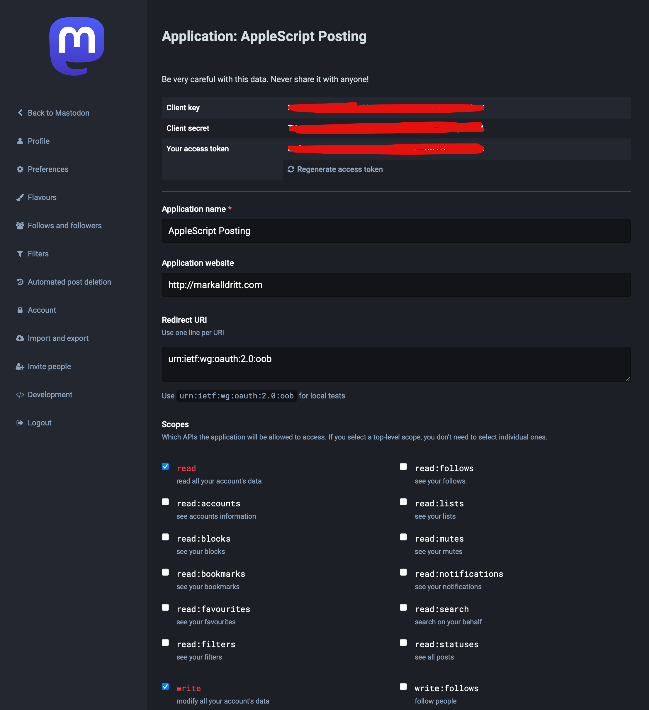

# DiscourseLib

MastodonLib is a library that allows you to query [Mastodon](https://joinmastodon.org) timelines and post to a Mastodon account from AppleScript.  This library is far from a complete implementation of the Mastodon API.  

## Installation

Enter the following command in the `Terminal` application to install the latest version of MastodonLib Lib on your machine:

~~~~
curl https://raw.githubusercontent.com/alldritt/AppleScriptLibraries/master/MastodonLib.applescript | osacompile -o ~/Library/Script\ Libraries/MastodonLib.scpt
~~~~

## Usage

### Configuration

1. Install MastodonLib as described above

2. Create an application for your AppleScript script on your Mastodon instance.  Visit your Mastodon account's web interface and navigate to Preferences and then to Development.  Press the **New Application** button to create an application.  Take note of your application's Client key and Client Secret.  Your completed application will look similar to this:

  

2. Load MastodonLib and configure it with your domain, client key and client secret:

	~~~~
	use AppleScript version "2.4" -- Yosemite (10.10) or later
	use MastodonLib : script "MastodonLib" version "1.0"
	use scripting additions
	
	--	Mastodon properties
	set MastodonLib's APIDOMAIN to "https://mastodon.example" -- your Mastodon instance's URL
	set MastodonLib's APICLIENT_KEY to "your mastodon instance app client key"
	set MastodonLib's APICLIENT_SECRET to "your mastodon instance app client secret"
	~~~~

### Post A Status

~~~
--	Post a new status
set newStatus to "Test post from AppleScript"
set newContentWarning to "Content Warning" (* or missing value *) 
set newVisibility to "public" (* or missing value *)
MastodonLib's postStatus(newStatus, newContentWarning, newVisibility)
~~~

### Read the Home Timeline

Mastodon servers return timelines in batches of 20-40 status entries.  You'll have to repeatedly call `getHomeTimeline` to read the entire home timeline.  You may want to cache the ID of the last status read to facilitate efficiently getting new status messages in future.

~~~
set maxStatusID to missing value
repeat
	set statusItems to getHomeTimeline(maxStatusID, missing value, missing value, missing value)
	set statusItemsCount to count of statusItems
	if statusItemsCount = 0 then
		exit repeat
	else
		set maxStatusID to ((last item of statusItems)'s objectForKey:"id") as text

		-- do something with the statusItems array of status entries		
	end if
end repeat
~~~

### Read a Hashtag Timeline

Mastodon servers return timelines in batches of 20-40 status entries.  You'll have to repeatedly call `getHashtagTimeline` to read the entire hashtag timeline.  You may want to cache the ID of the last status read to facilitate efficiently getting new status messages in future.

~~~
set hashtag to "applescript"
set maxStatusID to missing value
repeat
	set statusItems to getHashtagTimeline(hashtag, maxStatusID, missing value, missing value, missing value)
	set statusItemsCount to count of statusItems
	if statusItemsCount = 0 then
		exit repeat
	else
		set maxStatusID to ((last item of statusItems)'s objectForKey:"id") as text

		-- do something with the statusItems array of status entries		
	end if
end repeat
~~~

### Rate Limiting

Mastodon servers may rate limit API calls.  Please be kind to your Mastodon instance.
